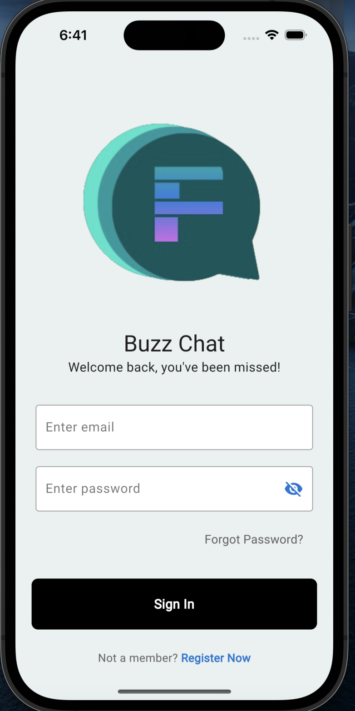

# BuzzChat Public Version

This repository contains a limited version of BuzzChat, showcasing the authentication code and selected parts of the app. For a complete preview of the app, including full source code and additional features, please email Varun Kaushal(me) at [kaushalvarunkv@gmail.com].

BuzzChat is a cross-platform chatting application developed with Flutter and Dart for Copperbell Inc under the Finnkosha Project. It features real-time one-to-one messaging, group chats, the ability to send attachments, and access additional content within chats. The application leverages Cloud Firestore for data management, Firebase Authentication for user management, and Firebase Storage for handling profile images. Developed using Agile Methodology, BuzzChat also supports dark mode and light mode, as well as a chat bot functionality.

## Table of Contents

- [Features](#features-of-full-version)
- [Tech Stack](#tech-stack-of-full-version)
- [Screenshots](#screenshots)
- [Installation](#installation)
- [Usage](#usage)
- [Contact](#contact)


## Features of Full Version

- **Real-Time Messaging:** Send and receive messages in real-time with one-to-one and group chat functionality.
- **Group Chats:** Send and receive messages in real-time with other users using group chat functionality.
- **Attachments:** Share pdf files within chats.
- **Profile Images:** Upload and display profile images using Firebase Storage.
- **Search Functionality:** Quickly find messages and contacts with the integrated search feature.
- **Dark Mode and Light Mode:** Toggle between dark and light themes to suit your preference.
- **Chat Bot:** Interact with a built-in chat bot for assistance and automated responses.

## Tech Stack of Full Version

- **Frontend:** Flutter
- **Programming Language:** Dart
- **Database:** Cloud Firestore
- **Authentication:** Firebase Authentication
- **Storage:** Firebase Storage

## Installation

### Prerequisites

- Flutter SDK: [Installation Guide](https://flutter.dev/docs/get-started/install)

### Setup

1. **Clone the repository:**

   ```bash
   git clone https://github.com/your-username/Buzzchat-Public.git
   cd Buzzchat-Public
   ```

2. **Install dependencies:**

   ```bash
   flutter pub get
   ```

4. **Run the app:**

   ```bash
   flutter run
   ```

## Usage

### Basic User Guide

1. **(Present in public version, full functionality in Full Version) Sign Up / Login:** 
   - Use your email and password to create an account or log in.
    
2. **(Full Version only) Chat:**
   - Start a one-to-one chat or create a group chat.
   - Send messages, attachments, and use emojis.
   - Search for messages or contacts using the search bar.

3. **Settings:**
   - Toggle between dark mode and light mode.

4. **(Full Version only)Chat Bot:**
   - Access the chat bot from the main menu for assistance and automated responses.

## Screenshots
### Authentication Screens


### Home Screen


### Chat Screens


### Edit & Info Screens


### Forgot Password Screens


### Password Reset Mail & Portal


## Contact

For the full app code and preview, please email Varun Kaushal(me) at [kaushalvarunkv@gmail.com].